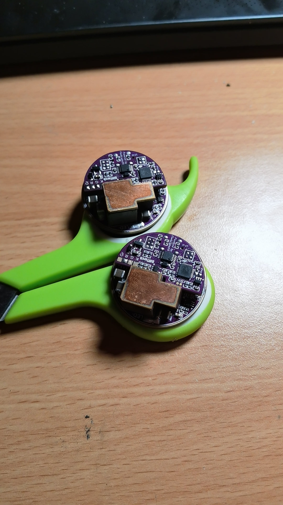
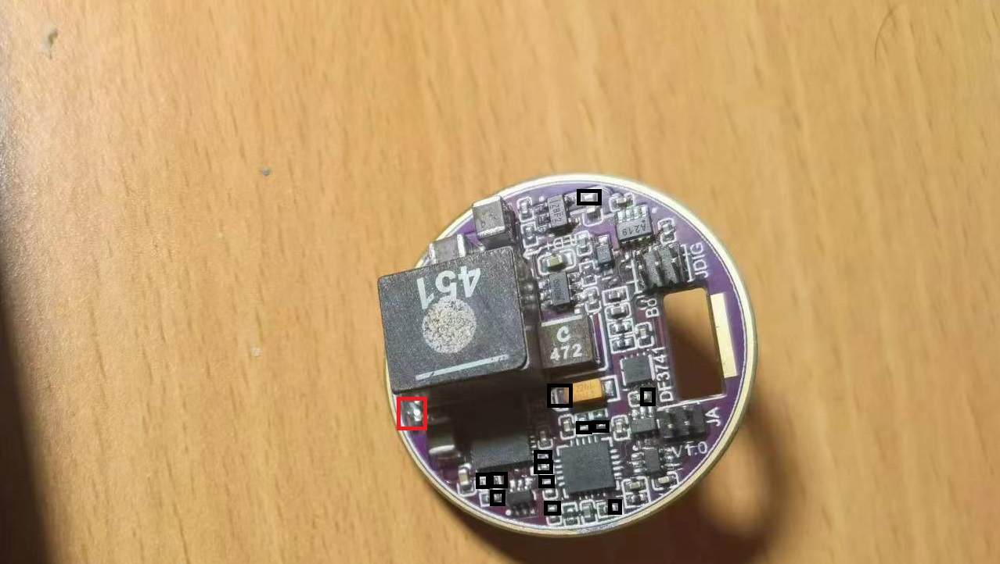
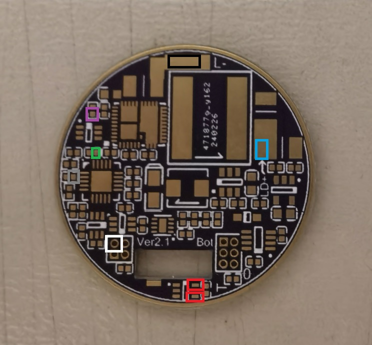

### 概述

这是和[FlashLightOS](https://github.com/redstoner-35/FlashLightOS "固件地址")固件所搭配的Xtern Ripper V3.0的硬件平台。也是该固件的官方首发平台。该硬件平台一共有5块PCB,分别是功率板,MCU板和侧按PCB，月光DLC小板和月光DLC取电riser板。

### 工程结构

该工程一共有九个文件夹，分别对应九套PCB。文件格式为Altium Designer 15。可以用LCEDA导入后转换为LCEDA格式以便查看BOM和位号。各个PCB作用如下：

+ PCB-DiffTorch-PowerStage：这个文件夹包含完成降压恒流DCDC变换的功率级，电池功率计以及线性和PWM调光的电路,以及辅助电源的底板PCB。
+ PCB-DiffTorch-MCU：这个文件夹包含MCU相关的外围电路，以及按键去抖和配置EEPROM,包括typec console口和DFU功能的相关电路。
+ PCB-DiffTorch-MoonLight：这个文件夹包含负责0.04-3.9A的小电流和月光挡位所使用的月光DLC子板。
+ PCB-DiffTorch-MoonLightPWR-Riser：这个文件夹包含将从DrMOS旁边的MLCC电容取电给月光DLC子板提供+12V电源的riser板。

+ PCB-Difftorch-CalibrationKit ：这个文件夹包含这套驱动配套使用的校准工装板。虽然驱动不依赖于此PCB运行，但是在生产过程中进行试运行校准电流输出时必须使用此板，否则驱动无法准确的调控电流输出。

+ PCB-DiffTorch-SideKey：这个文件夹包含这套驱动配套使用的LED侧按按键板，通过细排线连接到驱动上层的子板。侧按板直径12mm，适配东东海D8B外壳。
+ PCB-DiffTorch-BattHolder ：这个文件夹包含给东东海D8B/D7D通用三锂电串联电池架所准备的加强件。使用弹片负极大面积铜柱正极可以持续承受20A的放电输出。且具有2A电流的主动均衡功能。
+ PCB-DiffTorch-BattTypecCharger：这个文件夹包含给东东海D8B外壳配套的Typec充电节所准备的三锂电串联直充板子，支持标准功率（9V2A 18W）的快速充电。此驱动并不依赖于此PCB。
+ PCB-DiffTorch-BattTypecCharger-V2：这个文件夹包含给东东海D8B外壳配套的Typec充电节所准备的三锂电串联直充板子，支持65W PD3.0的高功率快速充电。此驱动并不依赖于此PCB。

### 散热五金铜件

虽然此驱动的运行效率极高，但是因为能量守恒的缘故不可能所有的输入能量都转化为输出，总会有一部分会转换为废热。因此本驱动设计了一套铜制的导热块，可以通过导热垫快速的将驱动中的辅助Buck芯片，DrMOS以及主电感的损耗所产生的热量传递到外壳进行散热。铜块的3D制造图纸（solidworks格式的源文件）包含在`HeatTransferBlock`文件夹内。该铜块为了节省成本采用的是分成三块激光切割后使用SAC305焊锡焊接在一起的设计。对于国内用户，该散热零件的制造可以通过[漫龙钣金](https://item.taobao.com/item.htm?_u=s3r5eurrdaa7&id=674840959286&spm=a1z09.2.0.0.62242e8d2eB4sE)进行。其中1.5mm厚度的部分采用激光切割，然后8.5mm厚度的部分采用激光切割+CNC铣平表面，一套散热模块的制造成本大约为100RMB。该散热零部件的组装效果图如下：

**警告：此散热铜块是保证驱动正常运行的必须零部件！绝对不允许省略否则驱动的零部件将会过热烧毁！**

### 性能

#### 3V灯珠版本

+ 电流：0.05-40A
+ 效率：98.6% @ If=20A 97.0% @ If=30A
+ 静态电流：P0运行时50mA(主buck启动)，20mA(副buck启动)，高功耗待机P1时17mA，P2深度睡眠模式时0.15mA
+ 开关频率：1MHz（主Buck）1.16MHz(辅助buck)
+ 恒流精度：大电流下校准后平均1%，小电流4%内

#### 6V灯珠版本

+ 电流：0.05-33A
+ 效率：97.4% @ If=33A
+ 静态电流：P0运行时0.14A(主buck启动)，20mA(副buck启动)，高功耗待机P1时17mA，P2深度睡眠模式时0.15mA
+ 开关频率：1MHz（主Buck）1.16MHz(辅助buck)
+ 恒流精度：大电流下校准后平均1%，小电流4%内

**注意：效率为我使用4层2Oz的功率板PCB和原理图内标称参数实测所得，由于最终用户的用料调整和参数调整，不一定能达到标称的最高效率。**

### 焊接调试注意事项

这个工程包含150+元器件，五块PCB，而且有非常小且高引脚密度的QFN和SON-8芯片（最小封装2x2mm），大量的SOT323和0402原件，因此对焊接者的手工有非常高的要求。焊接工具方面需要的准备如下：

+ 加热台
+ 趁手的大功率恒温刀头烙铁（例如JBC245）
+ 高质量的焊锡
+ 高性能的恒温旋风热风枪
+ BGA焊接用的那种高品质助焊剂
+ 63/37配方的有铅中温锡膏
+ 高质量的镊子
+ 吸锡带（用来处理typec座子和QFN连锡）
+ 万用表

#### MCU上层子板的调试焊接

首先应该焊接的是MCU子板，这块板子会比较难焊接，我建议的焊接顺序如下：

1. 使用有铅锡膏和加热台贴装正面的QFN-32封装的HT32F52352单片机
2. 在加热台上面趁热用烙铁给PCB所有焊盘上锡。然后风枪焊接PCB正面所有的芯片（一共2个SOT32*，一个SOT23-3的LDO，一个MSOP-10的USBMUX）
3. 焊接PCB正面的两个二极管
4. 焊接PCB正面所有的0402和0603封装的电阻电容
5. 使用锡膏+风枪贴装背面的UDFN-8封装的FM24C512D EEPROM（此芯片体积极小，容易连锡，先贴装会比较好处理一些）
6. 用烙铁给背面所有贴片焊盘上锡，贴装背面的MSOP-10封装的CH340E
7. 贴装背面所有的0402封装的电阻电容
8. 贴装背面的3225晶振,二极管和SOT323的2N7002KW

全部贴装完毕之后，就需要利用万用表的二极管档进行按照下图指示的位置（红表笔接如图红框位置的焊盘，黑表笔接黑框位置）进行测试，此时万用表的读数应该在0.4-0.7V之间。如果是0或者很低，则说明有芯片方向反了或者HT32F52352焊接出问题连锡短路，需要处理干净。确保没有短路之后就可以准备开始贴装typec座子。这个座子因为是立贴的，贴装会较为困难，具体步骤如下：

1. 用镊子在PCB的Type-c座子上均匀的涂抹薄薄的一层锡膏。
2. 将座子放上去，风枪开320度，风速5-6级，围着座子均匀的打圈圈直到锡膏融化。
3. 熔化后趁热将座子拿下，用烙铁和吸锡带去除掉座子引脚和PCB焊盘上连一起的焊锡。
4. 在PCB上薄薄涂抹一层焊油，将座子放回去
5. 风枪330度风速5-6级围着座子均匀打圈直到焊锡熔化，座子会微微下沉和PCB贴合。
6. 撤走风枪等待冷却。
7. 用烙铁+焊锡将四个固定脚焊接到PCB上。

焊接完毕的成品的正面和背面如下所示：

焊接完毕后就可以把板子丢进洗板水里面清理干净，下一步则是连接电脑刷机。你需要准备一条typec线（A to C和C to C都支持）然后去合泰半导体官网下载[HT32 Flash Programmer](https://www.holtek.com.cn/documents/10179/6393521/HT32_Flash_Programmer_v109d.exe "HT32 Programmer")然后用镊子短接正面如图所示的两个触点，短接之后插上USB线。此时你应该听到USB设备插入的声音。如果没有声音或者提示未知的USB设备，那你就需要检查你MCU、typec座子、正面那个MSOP-10的USB MUX以及电源部分的SOT23封装的LDO是不是虚焊了。

然后下一步就是打开HT32 Flash Programmer软件，将portname调为USB，接着点击右下角的connect。

如果焊接没有问题，软件会提示connected，然后你就需要在Code页面选择随工程一起附带的[debug版本固件](/PCB-DiffTorch-MCU/FlashLightOS-Debug.hex "debug固件")。下面的flash option里面勾选上Erase、Program、Verify，然后点击Programming。此时程序会自动给您的驱动板刷入固件。当程序提示operation success之后，你就可以将小板拔下并重新连接。此时你应该听到设备接入的声音。然后你要干的就是去设备管理器里面看看有没有COM和LPT的子项出来。如果固件正常运行，则会有相应的子项，在我这台电脑上，分配的端口为COM7。

接着就可以打开putty软件，配置好参数然后连接驱动，输入ver然后回车。如果固件正确运行应有如下输出：

如果有输出则说明固件已经成功启动。接下来则可根据您所使用的LED类型通过fruedit命令设置系统的FRU单元数据。

#### 下层功率板的焊接

下层功率板的焊接难度就相对比较低一些，但是也需要遵循一定的焊接顺序去焊接。因为元器件比较多因此建议每焊一步就测量一次否则最后焊接完上电发现短路就非常难找问题。特别是板子上的那几个体积很小的SOT323-6器件。我建议的焊接顺序如下：

1. 使用SAC305(Sn96.5 Ag3 Cu0.5)的无铅高温锡膏+加热台贴装MP86956GMJT(6V33A满血版本必须使用此器件否则功率会受限，3V版本则可用MP86956GMJ代替)，LT3741和AD5693RACPZ这三颗芯片。贴装方法是在焊盘上点一点锡膏，芯片压上去然后丢上加热台加热。当锡膏熔化后用镊子轻压芯片挤出多余的焊锡之后用烙铁拖干净芯片的引脚，如果引脚焊锡量不足则适当补充。**注意：MP86956GMJ/GMJT是一个非常脆弱的芯片，因此不建议在淘宝购买而是在贸泽电子下单。在贴片时你一定要确保你的加热台具有合适的PID恒温控制器确保加热台温度全程不超过230℃且暴露在超过200℃的时间不超过1分钟，否则你会收获一块MOS温度检测半身不遂的功率板。如果您的功率板很不幸出现了这种情况，则您需要准备一块新的PCB和芯片并重新开始这个步骤。如果您对于焊接没把握则建议改用Sn63Pb37的中温锡膏进行焊接以降低焊接难度。**
2. 贴装完毕后，使用万用表二极管档测量如下的位置，应该有0.3-0.5的压降。如果有地方为0的就需要检查是否连锡，无穷大的话就是虚焊了（每个黑色框表示黑表笔，红色表示红表笔）

3. 贴装右下角的两颗CH443k(对于国外用户也可以用ON SEMI的NC7SB3157P6X代替，WCH的CH443K在海外不太容易购得)
4. 烙铁给所有SMD件的焊盘上锡，贴装所有的0402电阻电容。
5. 贴装正面剩下的所有芯片。
6. 贴装辅助电源的电感（0420CDMCCDS-6R8）和输出的钽电容（3216 22uF 10V）
7. 贴装正面的0603以及1210尺寸的MLCC电容

正面所有元器件贴装完毕之后，就可以翻面贴装背后的所有原件，需要注意：正面的大电感是最后贴的，不能着急。背面的原件贴装顺序如下：

1. 贴装背后所有的0402元器件
2. 贴装背面的SOD323二极管和INA199A1DCKR放大器
3. 贴装背面的SMD贴片铜条。位置如下图所示，贴装方法是用烙铁在焊盘上面涂上薄薄一层焊锡然后风枪吹上去。贴片铜条一共有两种规格，分别是[方形3x1.5厚1.0mm](https://item.taobao.com/item.htm?spm=a1z09.2.0.0.5e312e8dNFkk1e&id=679291106491&_u=q3r5eurrbd39 "3x1.5厚1.0mm")以及[方形3x3厚2mm](https://item.taobao.com/item.htm?spm=a1z09.2.0.0.5e312e8dNFkk1e&id=679291106491&_u=q3r5eurrbd39 "3x1.5厚2.0mm")

4. 贴装背面的2512检流电阻。贴装的时候一定要检查开尔文接法的两个焊盘是否顺利上锡。焊接结束后可以用万用表欧姆档测一下正面如下图所示的两个引脚之间的阻值，如果测量结果为近似短路则说明焊接OK。

5. 贴装背面的0805 MLCC和35V 150uF的钽电容。[TCJU157M035R0100E](https://www.mouser.cn/ProductDetail/KYOCERA-AVX/TCJU157M035R0100E?qs=Rp5uXu7WBW9z8RZr358d7g%3D%3D)这颗钽电容在国内现货极少需要海淘，建议从mouser购买。**注意：大号钽电容贴装之前，一定要上加热台70-80度预烘干6-8小时，然后趁热贴装，否则电容里面的水气会导致电容鼓包报废！**

6. 贴装正面的XAL1010-221MEB大电感。贴装的时候首先在焊盘表面完全覆盖一层薄薄的锡膏，然后电感放到位，风枪开320度，高风速围着电感打圈并时不时吹电感底部和PCB之间的空隙直到焊锡熔化，然后撤走风枪等待冷却即可。

所有器件贴装完毕后，你就需要准备一个可调电源，电压调整至12V，电流0.2A，然后给驱动板子上电。背面中心那个圆形的焊盘为正极，旁边一圈为GND。此时上电后应该没有任何电流（显示0.00几A）如果有很大的电流则说明有芯片焊反了或者某些地方连锡短路，此时你应该立即断电并检查。你需要把焊接不良的地方彻底处理干净确保上电没有电流才算成功。然后你需要用万用表电压档在驱动上电的时候测量一下电压（黑表笔接黑框位置，红表笔接红框位置）应当是非常稳定的3.3V。

如果你测量到了非常稳定的3.3V,则说明系统的待机辅助电源(3V3SB)已经准备好了。接下来的操作是首先拆除灰白色圈内所示的SN74LVC1G08DCKR，然后用一坨锡短接功率板子右下角的测试点（红色圈）再度给板子上电观察电流，如果电流依然接近0，则使用万用表电压档分别测量橙色，绿色以及蓝色圈所示位置的电压（黑表笔接黑色圈所示位置）。

+ 绿色：3.3V±5% 如果没电压或者电压不对检查反馈电阻，DCDC使能的200欧电阻，104自举电容是否焊接正常且器件参数正确。
+ 橙色：0.8V±10% 如果你测到3.3V或者0V且绿色位置电压正确的话，那恭喜你，MP86956GMJT已经被你弄的半身不遂（报废）了，准备一块新的PCB和芯片然后重新从步骤1开始吧。
+ 蓝色：1.5V±5% 如果电压为0或者偏高，检查BSS138PS是不是坏了或者偏置电阻阻值错误。

如果这些位置电压都正确，则下一步可以开始功率板主变换器的试运行。此时你需要将可调电源的电流设置为1A，电压维持12V不变。然后在上电的情况使用镊子短接下图红色圈内的两个焊点并观察电流，短接后电源电流应在0.15A左右，如果电流为0则检查LT3741芯片本身和外围电路是否焊接正确。如果电流正常则使用万用表测量绿色、蓝色、灰色和白色圈所示的电压（黑表笔接黑色圈所示位置）。

+ 绿色：5V±5% 如果没电压或者电压不对检查LT3741芯片焊接是否正常
+ 灰色：2V±1% 如果没电压或者电压不对检查LT3741芯片焊接是否正常
+ 白色：0.8V±10% 如果你测到3.3V则检查LT3741外围是否正确，可以用示波器测量紫色点观察PWM信号的频率和占空比是否正确
+ 蓝色：7.8V±10%

如果电压都正确，则使用具有频率和占空比测量功能且带宽至少100M的数字示波器测量紫色点位置的波形。正常的波形应当是0-3.3V范围波动的方波，频率1MHz左右。接下来则使用趋势捕获功能观察占空比的在1000mS内的波动，正常情况下占空比的波动不应该超过±2%，如果频率不正确或者占空比出现了大范围的波动则说明环路失稳，此时则需要检查LT3741的环路补偿电阻电容和频率设定电阻阻值是否正确。

以上内容测试都正常则说明功率板调试已经完成。此时则需要去除红色圈所示的短接点并补上白色圈所示的SN74LVC1G08DCKR芯片，然后将功率板放置于超声波清洗机内震洗至少15分钟以完全去除板子上的助焊剂和锡膏残留以免后续使用时腐蚀焊点或引起漏电导致主板工作异常。

#### 月光DLC辅助子板的焊接

文档编写进行中......

----------------------------------------------------------------------------------------------------------------------------------
© redstoner_35 @ 35's Embedded Systems Inc.  2024